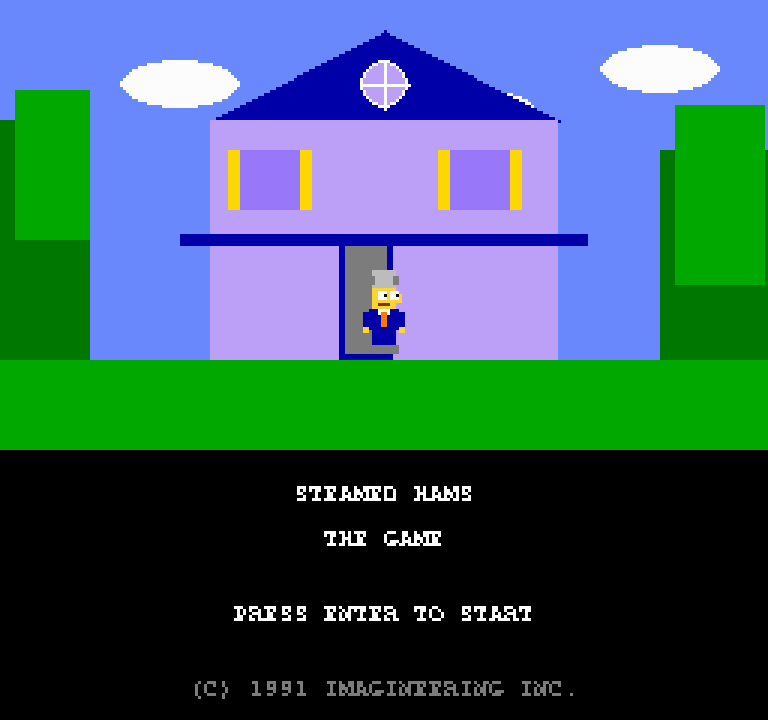
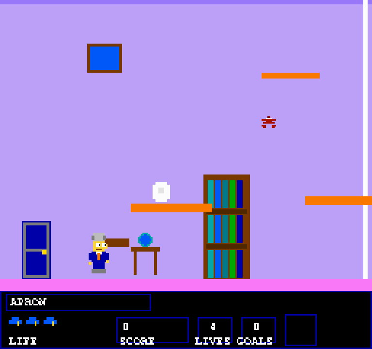
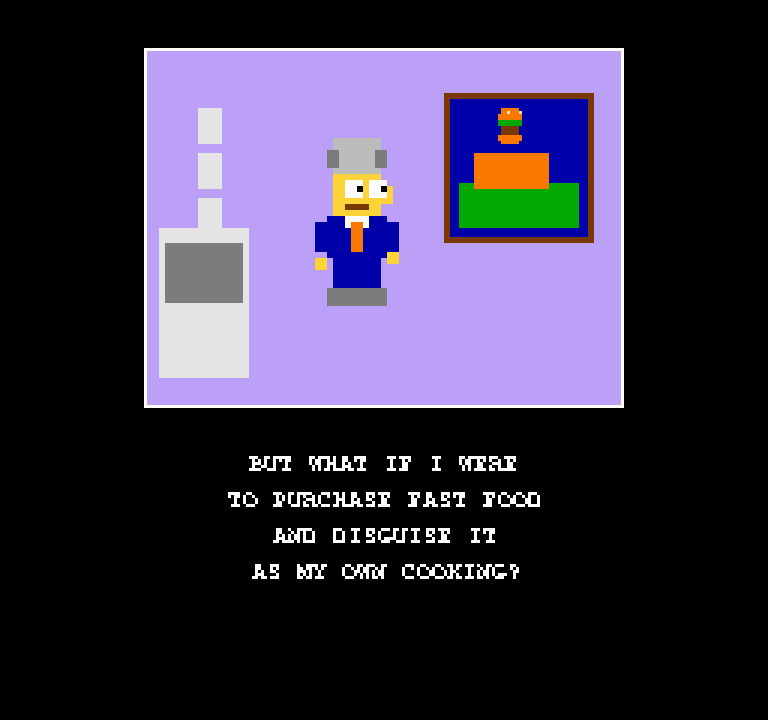
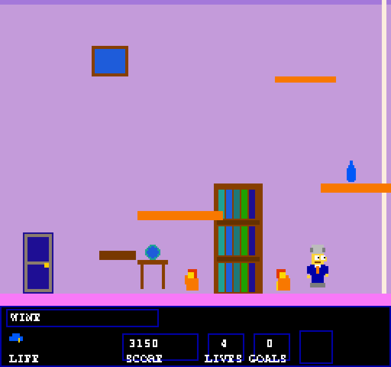

# Steamed Hams: The Game

An NES-style platformer based on [Steamed Hams, but it's an NES game from 1991](https://www.youtube.com/watch?v=D1ZPGGbrBQs) by Fictional Bad Games.

Built entirely in a single Python file using pygame-ce. All sprites are drawn with primitives -- no external assets required.

## Screenshots






## Requirements

- Python 3.13+
- [uv](https://docs.astral.sh/uv/)

## Running

```
make run
```

Or directly:

```
uv run python steamed_hams.py
```

## Controls

| Key | Action |
|-----|--------|
| Arrow keys | Move |
| Z / Space / Up | Jump |
| Enter / X | Advance dialogue |

## Gameplay

Collect all required items in each level, then reach the exit door. Stomp enemies from above to defeat them -- touching them from the side costs health.

Five levels follow the Steamed Hams storyline:

1. **Skinner's House** -- Grab the apron and kitchen key
2. **School Hallway** -- Find the spray can and hall pass
3. **Street to Krusty Burger** -- Pick up fast food supplies
4. **Thought Bubble** -- Collect "Steamed Hams" and "Upstate New York"
5. **House on Fire** -- Grab the wine before it's too late

Seven cutscenes with full dialogue play between levels.

## Architecture

- Internal resolution: 256x240 (NES standard), scaled 3x to 768x720
- State machine: title -> cutscene/level alternation -> credits
- NES-style square wave sound effects generated at runtime
- Scanline overlay for authentic CRT feel
- One-way platforms (jump through from below, land on top)
